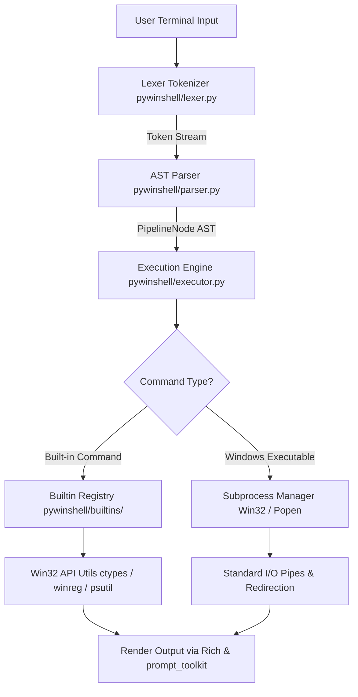

# 🐍PyWinShell

<div align="center">


**A modern, Windows-native interactive command-line shell written in Python.**

[](https://www.python.org/)
[](https://www.microsoft.com/windows)
[](LICENSE)
[](#-testing--verification)

[Overview](#-overview) •
[Features](#-key-features) •
[Architecture](#-system-architecture) •
[Setup & Usage](#-setup--installation) •
[Built-in Commands](#-built-in-commands-reference) •
[Project Structure](#-project-structure)

</div>

---

## 📖 Overview

**PyWinShell** is a feature-rich, high-performance command-line shell built specifically for the **Windows OS environment** using Python. PyWinShell bridges the gap between Unix-style REPL pipelines (`|`, `>`, `>>`, `<`) and native Windows operating system primitives (Win32 API interop, Windows Registry queries, process token elevation checks, and NTFS path conventions).

Designed with a modular compiler-style architecture, PyWinShell includes custom **Lexing**, **AST Pipeline Parsing**, **Process Stream Supervision**, and an interactive REPL with dynamic autocompletion.

> [!NOTE]
> PyWinShell automatically detects Windows Administrator privilege elevation tokens (`IsUserAnAdmin`) and dynamically adjusts prompt indicators and execution security.

---

## ✨ Key Features

- 🪟 **Native Windows OS Integration**:
  - **Elevated Privilege Detection**: Real-time detection of Administrator tokens (`⚡ ADMIN`).
  - **Windows Registry Inspector**: Built-in tool (`reg query`) to inspect `HKCU` and `HKLM` hives directly.
  - **Windows Task Manager (`task`)**: List processes, view parent-child process trees (`task tree`), terminate (`task kill`), suspend, and resume process execution.
  - **Drive Letter Navigation**: Seamless directory navigation supporting Windows drive switching (e.g. `D:`, `C:`).

- 🎨 **Modern Interactive REPL**:
  - **Dynamic Multi-Segment Prompt**: Displays elevation status, current path (shortened `~`), Git branch indicators, and status arrows.
  - **Intelligent Autocomplete**: Tab completion for built-ins, custom aliases, PATH executables (`.exe`, `.bat`, `.cmd`, `.ps1`), and file paths.
  - **Persistent Command History**: Maintains command history across sessions saved to `~/.pywinshell_history`.

- 🔄 **Advanced Pipeline & I/O Engine**:
  - **Multi-Stage Pipelines (`|`)**: Pipe data between built-in commands and native Windows executables.
  - **File Redirection (`>`, `>>`, `<`)**: Truncate/append output redirection and input stream redirection.
  - **Background Execution (`&`)**: Launch non-blocking background tasks.

- 🛠️ **Extensible Alias Engine**:
  - Define custom shell shortcuts dynamically (e.g. `alias ps='task list'` or `alias ll='dir'`).

---

## 🏗️ System Architecture

PyWinShell uses a multi-layered design separating input processing, AST parsing, and process execution.



---

## 📂 Project Structure

```text
PyWinShell/
│
├── .gitignore                   # Excludes Python cache, environments, & history files
├── README.md                    # Repository documentation and architecture guide
├── requirements.txt             # Third-party dependencies
├── setup.py                     # Setuptools configuration for global CLI installation
│
├── pywinshell/                  # Core Application Package
│   ├── __init__.py              # Package initialization & version info
│   ├── main.py                  # REPL loop, banner, and signal handler
│   ├── prompt.py                # Dynamic multi-segment prompt formatter
│   ├── lexer.py                 # Tokenizer for quotes, escapes, pipes, & redirection
│   ├── parser.py                # AST parser building PipelineNode structures
│   ├── executor.py              # Pipeline execution engine and stream manager
│   ├── completion.py            # Autocompleter for paths, PATH, and commands
│   ├── win32_utils.py           # Win32 API calls (IsUserAnAdmin, GetTickCount64, winreg)
│   │
│   └── builtins/                # Built-in Shell Utilities
│       ├── __init__.py          # Built-in command module exporter
│       ├── base.py              # Abstract Base Class & command registry manager
│       ├── filesystem.py        # cd, pwd, dir (Rich table), cat, mkdir
│       ├── process.py           # task command (list, kill, tree, suspend, resume)
│       ├── sysinfo.py           # sysinfo Neofetch-style system dashboard
│       ├── registry.py          # reg query Windows Registry utility
│       ├── env.py               # winenv environment variable manager
│       ├── history.py           # history logger and screen clearing (cls/clear)
│       └── alias.py             # Custom command alias manager (alias/unalias)
│
└── tests/                       # Test Suite
    ├── __init__.py              # Test package initializer
    ├── test_lexer.py            # Unit tests for tokenization
    ├── test_parser.py           # Unit tests for AST parsing
    └── test_builtins.py         # Unit tests for built-in commands
```

---

## ⚡ Requirements

- **Operating System**: Windows 10 or Windows 11 (64-bit recommended)
- **Python Version**: Python 3.10 or higher
- **Dependencies**:
  - [`prompt-toolkit`](https://github.com/prompt-toolkit/python-prompt-toolkit) (≥ 3.0.0) — Interactive REPL engine
  - [`rich`](https://github.com/Textualize/rich) (≥ 13.0.0) — Terminal formatting, tables, and colors
  - [`psutil`](https://github.com/giampaolo/psutil) (≥ 5.9.0) — Process inspection and system metrics
  - [`colorama`](https://github.com/tartley/colorama) (≥ 0.4.6) — Windows ANSI support
  - [`pywin32`](https://github.com/mhammond/pywin32) (≥ 306) — Win32 API extensions for Python

---

## 💻 Setup & Installation

### Option 1: Quick Run from Source

1. **Clone the repository**:
   ```cmd
   git clone https://github.com/Suchetamon27/PyWinShell.git
   cd PyWinShell
   ```

2. **Install requirements**:
   ```cmd
   pip install -r requirements.txt
   ```

3. **Launch PyWinShell**:
   ```cmd
   python -m pywinshell.main
   ```

---

### Option 2: Global System Installation (`pywinshell`)

Install PyWinShell in editable mode so you can launch it from **any folder** in Command Prompt or Windows Terminal:

```cmd
cd PyWinShell
pip install -e .
```

Now, launch PyWinShell from anywhere by typing:
```cmd
pywinshell
```

---

## 📋 Built-in Commands Reference

| Command | Description | Usage Example |
| :--- | :--- | :--- |
| `sysinfo` | Displays Neofetch-style system summary (OS, CPU, RAM, Disk, Uptime, Admin) | `sysinfo` |
| `task` | Windows Task Manager utility (subcommands: `list`, `tree`, `kill`, `suspend`, `resume`) | `task list` or `task kill 1234` |
| `reg` | Queries values from Windows Registry hives (`HKCU`, `HKLM`, `HKCR`, `HKU`) | `reg query HKCU Software` |
| `winenv` | View and modify environment variables dynamically | `winenv get PATH` or `winenv set FOO bar` |
| `cd` | Change current directory (supports drive letter switching) | `cd D:\Projects` or `cd ~` |
| `dir` | Formatted directory listing with mode, timestamp, and size | `dir` or `dir C:\Windows` |
| `cat` | Concatenate and display text file content | `cat file.txt` |
| `mkdir` | Create new directories | `mkdir new_folder` |
| `alias` | Create or view custom command shortcuts | `alias ps='task list'` |
| `unalias` | Remove a custom alias | `unalias ps` |
| `history` | View history of executed commands in current session | `history` |
| `cls` / `clear` | Clear the terminal screen | `cls` |
| `exit` / `quit` | Exit PyWinShell session | `exit` |

---

## 🧪 Testing & Verification

PyWinShell includes automated unit tests covering the Lexer, Parser, and Built-in Command modules.

Run the test suite using Python's built-in `unittest` runner:

```cmd
python -m unittest discover tests
```

**Expected Output**


---

## 🎯 Key Learnings

Developing **PyWinShell** provided hands-on experience with:
1. **Low-Level Win32 API Interop**: Querying Windows C-APIs (`ctypes.windll.shell32`, `GetTickCount64`) and inspecting Registry keys via `winreg`.
2. **Compiler & Lexer Primitives**: Building a tokenizer capable of handling quoted arguments, escape codes, pipe symbols (`|`), and file redirection operators (`>`, `>>`, `<`).
3. **Subprocess Management**: Managing stdin/stdout streams across multi-stage process chains using Python `subprocess.Popen`.
4. **Terminal User Experience**: Crafting dynamic REPL interfaces with tab completion, history persistence, and rich ANSI visual rendering.

---

## 📄 License

This project is licensed under the **MIT License**.
© 2026 Sucheta Mondal

---
              Made with ❤️ by Sucheta Mondal

<div align="center">
  <sub>Built for Windows Power Users and Python Developers.</sub>
</div>
